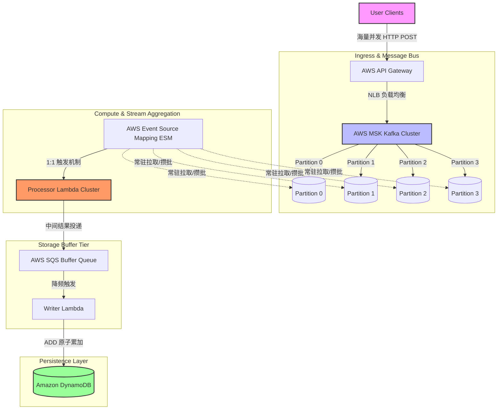
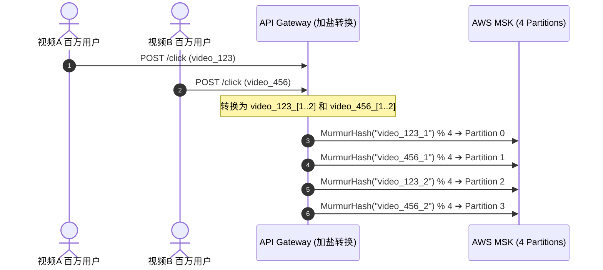
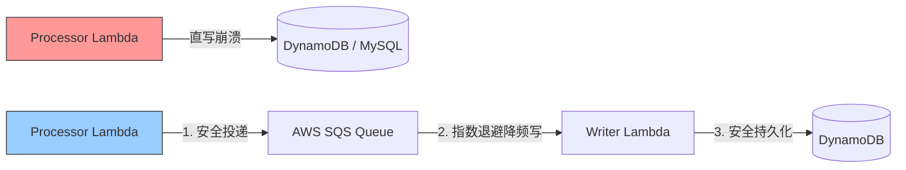

# RFC: Distributed High-Concurrency Real-Time Aggregation and Counter System

## 1. 业务背景与需求定义 (Requirements & Scope)

### 1.1 功能需求 (Functional Requirements)
* **高频计数持久化**：系统须准时、准确地记录全网海量 C 端用户触发的特定事件计数（如：视频播放量、点赞数）。
* **实时查询支持**：提供低延迟的读取接口，供用户查询当前事件的最新累计数值。

### 1.2 非功能需求 (Non-Functional Requirements)
* **高吞吐写能力 (Scalability)**：设计写吞吐量目标为 $\ge 1,000,000$ QPS，完美应对突发热点事件（如双热点视频同时爆火）。
* **高可用性 (Availability)**：系统整体可用性指标（SLA）须达到 99.999%，具备极强的容错与故障自愈能力。
* **低延迟写入 (Latency)**：客户端写请求接入延迟（Ingress Latency）控制在 $P99 \le 10\text{ms}$。
* **一致性模型 (Consistency)**：数据遵循**最终一致性 (Eventual Consistency)**模型，允许写回底座存储存在秒级延迟，但保证数据不丢失、不重计。

---

## 2. 概要架构设计 (High-Level Architecture)

系统基于 **“流量异步化、计算局部化、写入批量化”** 的核心思想设计，采用读写分离（CQRS）模式，完全基于云原生托管服务构建。



---

## 3. 详细设计与核心状态仿真 (Detailed Design & Data Flow)

### 3.1 双热点场景仿真 (Hotspot Scenario Simulation)

设当前系统内建有固定 Topic `video-clicks`，配置 **4 个物理物理分区 (Partition 0 ~ 3)**。
此时，视频 A (`video_123`) 与 视频 B (`video_456`) 同时爆火，两视频均产生每秒百万级的并发写请求。

### 3.2 路由分流机制：Key 加盐 (Key Salting)

为防止单一视频的数据被全部路由至 Kafka 的同一个物理 Partition，导致单点过载（Hot Partition），在接入层引入**加盐机制**：

1. **盐值计算公式**：

$$\text{Routed\_Key} = \text{video\_id} + \text{"\_"} + \text{Random}(1, N)$$


*(其中 $N \le \text{Partition 数量}$，本方案中 $N=2$)*
2. **Key 重写结果**：
* 视频 A 转换为：`video_123_1` 或 `video_123_2`
* 视频 B 转换为：`video_456_1` 或 `video_456_2`


3. **Kafka 物理分区路由**：
Kafka Producer 基于哈希公式进行管道分发：`MurmurHash3(Routed_Key) % 4`。
由于后缀不同，哈希值完全散列，数据路由结果定格如下：



### 3.3 计算层 ESM 攒批与内存聚合 (In-memory Aggregation)

* **AWS ESM 控制器配置**：设置 `BatchSize = 1000` 且 `MaximumBatchingWindowInSeconds = 1`。两者任一先满足即触发。
* **内存计算模型**：
AWS 自动激活并维持 4 个独立的 Lambda 实例对应消费 4 个 Partition。以消费 **Partition 0** 的 Lambda 实例为例：
1. ESM 捞取 1000 条属于 `video_123_1` 的单点事件，封装成一个 JSON 数组（Array）一次性输入该 Lambda 实例。
2. Lambda 内部代码（即 **In-memory Store**）在堆内存中开辟高效的一维 `HashMap`。
3. 执行 `for` 循环遍历该数组，纯内存操作耗时 $\le 2\text{ms}$，将 1000 条单点明细事件压扁、收拢为单条聚合消息：`{ "video_id": "video_123", "count": 1000 }`。
4. 提交当前批次的 Kafka Offset。


---

## 4. 技术选型辩护与权衡分析 (Technology Selection & Trade-offs)

### 4.1 计算层：为什么选取 AWS Lambda 而非 Amazon EC2 虚拟机？

* **弹性滞后性与冷启动考量**：
* **EC2 方案**：流量暴涨时需要依赖 Auto Scaling Group (ASG) 进行扩容。从启动实例、系统初始化到拉取业务镜像，**滞后时间通常长达 2~5 分钟**，突发的热点流量在这期间会直接阻断上游。
* **Lambda 方案**：采用 Serverless 架构，底层由 AWS ESM 守护进程按分区活跃度实施秒级弹性扩容。


* **常驻 Keep-Warm 特性**：
虽然 Lambda 在通用 HTTP 场景下存在冷启动（Cold Start）缺陷，但由于在此设计中，Lambda 属于 **Event-driven（事件驱动型消费）**，只要 Kafka 管道中持续输入高速流量，Lambda 容器实例便会**一直保持温暖（Warm 状态）并原地复用**。
* **高并发下的批次缩放性**：
当流量暴涨 100 倍时，Lambda 的实例数量并不会等比暴增 100 倍（防止下游雪崩）。它采用“批次填满”策略：在分配的并发实例数不变的前提下，单次接收的数组元素从平时的 10 条自适应填满至 1000 条，在不触及额外冷启动的前提下，系统吞吐量呈线性提升。

### 4.2 缓冲层：为什么在 Lambda 之后接入 SQS，而非直接写底座存储？



1. **建立物理隔离带（反向压力 Backpressure 削峰）**：
虽然第一级 Lambda 将流量压缩了 1000 倍，但在全球级高并发下，并行的多个 Lambda 实例一秒内仍会产生数万条批量统计结果。如果直接撞击底座存储，依然会触及数据库行级锁死锁或写容量拒绝（Throttling）。
2. **死信队列（DLQ）与容错（Durability）担保**：
若下游数据库因网络抖动或硬件故障引发短暂瘫痪，直写方案会导致 Lambda 重试耗尽并向 Kafka 抛出异常，进而引发全局消费积压（Lag）。
引入 SQS 后，消息将在队列内留存（最高支持 14 天）。写入失败的消息将留存队列并触发**指数退避重试**。若达到最大重试次数依然失败，会自动剥离至**死信队列（DLQ）**，确保整条主链路（Kafka $\to$ Lambda）永不阻塞。

### 4.3 存储层：为什么选取 Amazon DynamoDB 而非关系型数据库（如 MySQL / Aurora）？

* **彻底免除 B+ Tree 的行级锁竞争瓶颈**：
* **MySQL**：在面对极度集中的热点 Key（如热点视频 A）高频更新时，多个写线程会强行竞争同一行数据的 `EXCLUSIVE LOCK（排他锁）`。在高并发下，B+ 树的行级锁等待链表会无限拉长，引发严重的死锁和数据库线程池耗尽，吞吐量断崖式下跌。
* **DynamoDB**：全托管的 NoSQL 存储，其底层基于 **Consistent Hashing（一致性哈希）** 将行数据物理分散在海量存储分片（Storage Shards）上。它天然为高并发单 Key 更新设计，彻底摒弃了复杂的事务锁机制。


* **原生原子增量操作 (`ADD` Expression)**：
DynamoDB 支持行级无锁的原子加法。通过其内部的高效存储结构，多渠道、多分区传来的批量增量结果可以在底层分片中直接进行累加，无需分库分表（Sharding）中间件的介入即可轻松平滑跨越数十万级别以上的 WCU（写入容量单位）。

---

## 5. 基础设施即代码 (Infrastructure as Code - Terraform)

为确保方案的生产落地可行性，以下提供系统核心网络、计算及存储纽带的 Terraform 配置文件：

```hcl
# ==============================================================================
# 1. 削峰与缓冲层配置 (AWS SQS & DLQ)
# ==============================================================================
resource "aws_sqs_queue" "counter_dlq" {
  name                      = "video-counter-dead-letter-queue"
  message_retention_seconds = 1209600 # 死信最大存留 14 天，留足人工介入时间
}

resource "aws_sqs_queue" "counter_buffer_queue" {
  name                      = "video-counter-buffer-queue"
  message_retention_seconds = 86400 # 正常消息留存 1 天
  receive_wait_time_seconds = 20    # 强制开启长轮询 (Long Polling)，降低 API 成本

  redrive_policy = jsonencode({
    deadLetterTargetArn = aws_sqs_queue.counter_dlq.arn
    maxReceiveCount     = 5 # 失败重试 5 次后，强制移入死信队列
  })
}

# ==============================================================================
# 2. 流处理计算层配置 (AWS Lambda & ESM Windowing)
# ==============================================================================
resource "aws_lambda_function" "processor_lambda" {
  function_name = "video-click-stream-processor"
  role          = aws_iam_role.lambda_exec_role.arn
  handler       = "index.handler"
  runtime       = "nodejs18.x"
  memory_size   = 512 # 分配 512MB 内存，提供高速 CPU 周期及足够的 HashMap 堆空间
  timeout       = 30  # 限制单次批处理最大生命周期 30 秒
}

resource "aws_lambda_event_source_mapping" "kafka_esm" {
  event_source_arn  = aws_msk_cluster.msk_cluster.arn # 关联全托管 Kafka 集群
  function_name     = aws_lambda_function.processor_lambda.arn
  topics            = ["video-clicks"]
  starting_position = "LATEST"

  # 流处理流核心攒批控制
  batch_size                         = 1000  # ESM 内存切片最大元素件数
  maximum_batching_window_in_seconds = 1     # 攒批等待时间窗口最大延迟 1 秒
}

# ==============================================================================
# 3. 持久化存储层配置 (Amazon DynamoDB)
# ==============================================================================
resource "aws_dynamodb_table" "video_stats_table" {
  name         = "VideoStats"
  billing_mode = "PAY_PER_REQUEST" # 开启 On-Demand（按需）弹性模式，不设吞吐上限
  hash_key     = "video_id"

  attribute {
    name = "video_id"
    type = "S" # 字符串类型存储的主键 VideoID
  }

  point_in_time_recovery {
    enabled = true # 开启 PITR 连续备份，提供 Lead 级别灾备标准
  }
}

```

---

## 6. 系统局限性与权衡 (System Trade-offs & Limitations)

在实际的生产或高级别面试中，必须承认没有任何架构是完美的。本方案的局限性与取舍如下：

* **数据的瞬时非绝对一致性（牺牲强一致性换取吞吐量）**：
由于存在最大 1 秒的 Lambda 聚合窗口及 SQS 传输延迟，用户在点击点赞后如果**立即**刷新页面，其读取流（Query Service）在最初的几百毫秒内可能会读取到 Redis 缓存或 DynamoDB 里的旧数据。
* *辩护原则*：根据 **CAP 定理**，在高并发写场景下，我们必须牺牲强一致性（Consistency）来换取系统的极高可用性（Availability）与分区容错性（Partition Tolerance）。对于点赞数、播放量等业务场景，秒级的“最终一致性”是业界完全接受的商业妥协。


* **重复计算概率（At-Least-Once 语义）**：
若 Processor Lambda 在内存中将 1000 条数据聚合完毕并成功投递到 SQS 之后，突然遭遇服务器断电，导致未能及时向 Kafka 提交 Offset，Kafka 会发起 Rebalance 重新投递该批数据。这会导致计数被二次累加。
* *解决策略*：下游的 Writer Lambda 往 DynamoDB 写入时，如果需要强精准性，可以通过对每批数据生成全局唯一 UUID，并在 DynamoDB 写入端利用条件表达式（Conditional Update）实施幂等控制。但考虑到计数业务对极其微量的误差容忍度较高，通常维持默认的高吞吐非幂等设计，以换取最高的写入效率。


