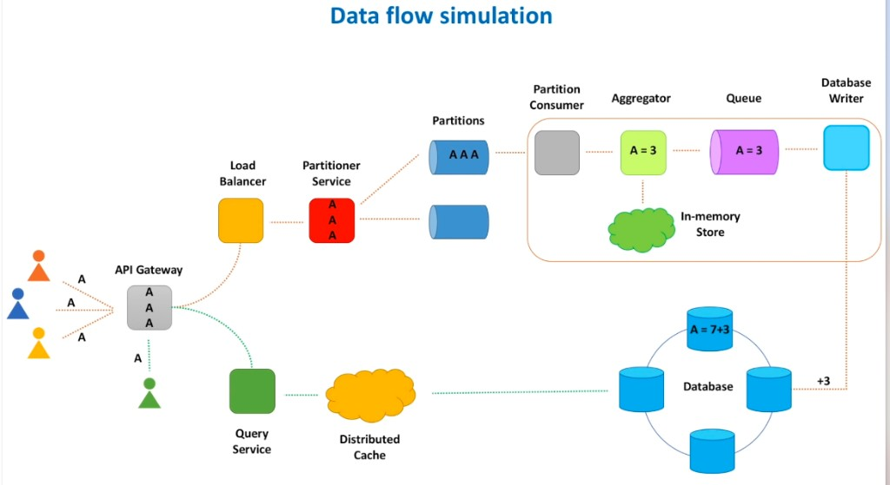
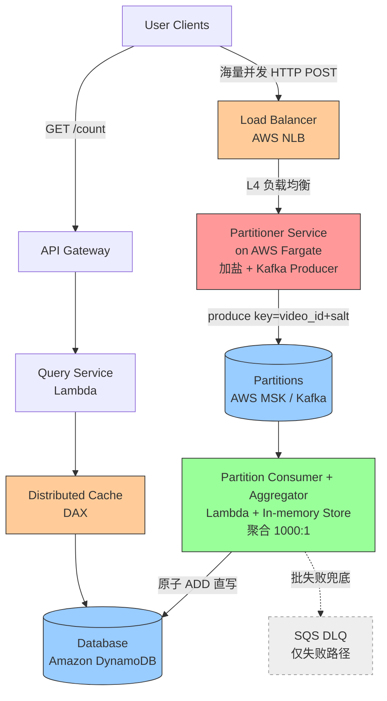
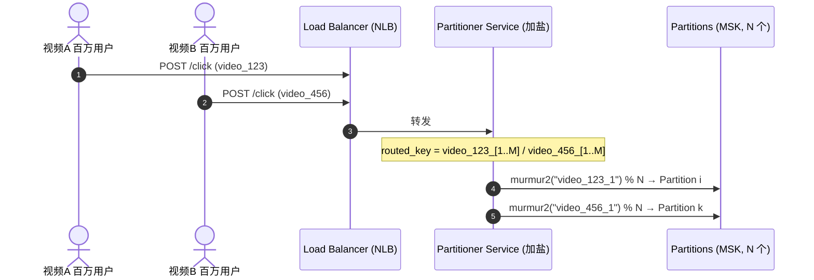

# RFC-001: 分布式高并发实时计数系统(**Kafka 版**)

> 适用前提:**团队已有 Kafka 生态(自建 Kafka 或 AWS MSK),短期内无法切换。**
> 本文在「保留 Kafka」的约束下给出生产可落地方案,**组件命名沿用下方 Data Flow Simulation 图的术语**。
> - 另一版纯托管(Kinesis)方案见 `rfc-002-distributed-counter-kinesis.md`。
> - 两版的横向对比、成本对照、选型决策树见 `rfc-003-kafka-vs-kinesis-comparison.md`。

---

## 0. 架构参考图 (Data Flow Simulation)

> 本方案的组件命名沿用此图术语(Load Balancer / Partitioner Service / Partitions / Partition Consumer / Aggregator / In-memory Store / Queue / Database Writer / Query Service / Distributed Cache)。



<!-- 如需替换为你自己的图,把图片放到 ./assets/ 下并改上面这行的路径即可 -->

---

## 1. 业务背景与需求定义 (Requirements & Scope)

### 1.1 功能需求 (Functional Requirements)
* **高频计数持久化**:准时、准确地记录全网海量 C 端用户触发的事件计数(如视频播放量、点赞数)。
* **实时查询支持**:提供低延迟读取接口,供用户查询当前事件的最新累计数值。

### 1.2 非功能需求 (Non-Functional Requirements)
* **高吞吐写 (Scalability)**:**峰值** 写吞吐目标 $\ge 1{,}000{,}000$ QPS,应对爆款视频。
* **高可用 (Availability)**:整体 SLA 目标 99.99%+,具备容错与故障自愈能力。
* **低延迟写入 (Latency)**:客户端写请求接入延迟 $P99 \le 10\text{ms}$。
* **一致性模型 (Consistency)**:**最终一致性**,允许秒级回写延迟,但保证数据不丢、可控不重计。

> **流量形态假设(贯穿全文成本分析)**:1M QPS 是**偶发峰值**而非常态(YouTube/TikTok 式爆款)。
> 详见 §4.5 的流量模型。这一点直接决定了「选预置还是按量」的成本结论。

---

## 2. 概要架构设计 (High-Level Architecture)

核心思想:**「流量异步化、计算局部化(攒批聚合)、写入批量化」**,读写分离(CQRS)。



> **与原图的差异说明**:
> 1. 原图写路径前端是 `API Gateway → Load Balancer`;本方案**写热路径只用 Load Balancer(NLB)**,把 API Gateway 从写路径拿掉——因为 1M QPS 下 API Gateway 按请求计费成本是灾难(见 §4.5)。API Gateway 仅留在**低流量的读路径**。
> 2. 原图 `Aggregator → Queue → Database Writer` 中的 **Queue 被省略**(理由见 §4.4),`Database Writer` 合并进 Aggregator 的直写动作;Queue 仅以**失败兜底 DLQ**(虚线)形式保留。
> 3. 原图的 `Distributed Cache` = 本方案 **DAX**。

**链路职责一句话:**
- **Load Balancer (NLB) → Partitioner Service**:接住 ingress QPS,**加盐**后用 Kafka Producer 写入 Kafka。**无状态、不碰 DB**,所以不会被下游打死。
- **Partitions (MSK Kafka)**:缓冲 + 解耦,使下游可以「攒批」。
- **Partition Consumer + Aggregator (Lambda)**:攒批拉取,把 ~1000 条单点事件在内存(In-memory Store)聚合成 1 条,**1000:1 压缩**。
- **Database (DynamoDB)**:原子 `ADD` 累加,把被盐打散的同一 video 重新合并回去。
- **读路径**:API Gateway → Query Service(Lambda)→ Distributed Cache(DAX)→ DynamoDB。

---

## 3. 详细设计与数据流 (Detailed Design & Data Flow)

### 3.1 双热点场景 (Hotspot Scenario)
Topic `video-clicks` 配置 **N 个 Partition**。视频 A (`video_123`) 与 视频 B (`video_456`) 同时爆火,各产生峰值百万级写请求。

### 3.2 ⭐ 关键澄清:原图红色的 "Partitioner Service" 是 Kafka 吗?

**不是。** 这是个常见误解,先讲清:

- **Partitioner Service(红色)= 生产者应用**:它是一段你自己写的、无状态的小服务,职责是「收 HTTP 请求 → 给每条事件算出 partition key(即**加盐**)→ 用 Kafka Producer 把消息 produce 进 Kafka」。本方案把它跑在 **AWS Fargate** 上。
- **Partitions(蓝色筒)= Kafka 本身**:即 MSK 里那个 topic 的多个物理分区,是**存储/消息总线**。

> 一句话:**Partitioner Service 是「往 Kafka 里写的人」,Partitions 才是 Kafka。** 两者完全不同。
> 之所以必须有这个 Partitioner Service,是因为 **API Gateway 不能跑 Kafka Producer**,加盐 + produce 这件事必须有一个计算层来做(见 §4.1)。

### 3.3 路由分流:Key 加盐 (Salting)

**为什么加盐**:若 `partition = hash(video_id) % N`,则 `video_123` 永远落到**同一个 partition** → 该分区后只有**一个**消费者 → 单点扛百万 QPS → **Hot Partition 打爆**。
加盐把 key 改写为 `video_123_[1..M]`,散列到多个 partition → **多消费者并行**,每个只扛 `峰值 / M`。

**在哪加盐**:加盐 = 重写 partition key,必须运行 Producer 代码 → **在 Partitioner Service(Fargate)里做**:

```text
routed_key = video_id + "_" + Random(1, M)   // M = 单热点 key 期望打散的分区数
partition  = murmur2(routed_key) % N          // Kafka 默认分区器
```

**加盐 ⇄ 聚合 是一对**:盐把同一 video 打散到多分区,所以下游必须有「合并」步骤把它加回来——由 Aggregator(按 `video_id` 去盐聚合)+ DynamoDB `ADD` 完成。



### 3.4 计算层:攒批 + 内存聚合 (In-memory Aggregation)
* **攒批配置**(Lambda 的 Event Source Mapping):`BatchSize = 1000`、`MaximumBatchingWindowInSeconds = 1`,任一先满足即触发。
* **聚合逻辑**(消费某分区的 Lambda):
  1. 一次性把该分区约 1000 条事件以数组输入 Lambda。
  2. 在堆内存(In-memory Store)建 `HashMap`,按 `video_id`(去盐)累加,纯内存 $\le 2\text{ms}$。
  3. 压扁成少量聚合消息,如 `{ "video_123": 1000 }`。
  4. 对每个 `video_id` 执行 DynamoDB 原子 `ADD`。
  5. 成功后提交 Kafka Offset。

> **关于 ESM(Event Source Mapping)**:它**不是一个要部署的服务/存储**,而是 AWS 托管的「轮询器」——自动从 Kafka 拉数据、攒批、再调用你的 Lambda。它是配置项(见 §5 Terraform),所以架构图里**不单独画盒子**,直接 `Partitions → Aggregator Lambda` 一根线即可。

### 3.5 容量与分区数估算 (Sizing)
- **分区数 N ≈ 峰值 QPS / 单分区可持续消费速率**;盐的取值 M 应 ≤ N,保证单热点 key 能铺满足够多分区。
- MSK ESM 可用「每分区并发批次数(1~10)」进一步提升单分区并行度。

### 3.6 读路径:为什么 GET 要走 DAX(Distributed Cache),而不是直读 DynamoDB?

**DAX 是什么**:**DAX = DynamoDB Accelerator**,AWS 专为 DynamoDB 打造的**全托管内存缓存**,**API 与 DynamoDB 完全兼容**(SDK 几乎零改造,endpoint 指向 DAX 即可,未命中自动回源)。延迟从 DynamoDB 的**个位数毫秒**降到 DAX 的**微秒级**。

**为什么 GET 必须经 DAX**:
1. **读也是热点**:写靠加盐打散了,但**读**全网都查同一个 `video_123` → 全部命中 DynamoDB 同一个 item。单 partition 读上限约 **3000 RCU/s**,热点读会 **throttling**。DAX 在内存挡掉重复读。
2. **延迟**:DAX 微秒级,稳稳满足低延迟读 SLA。
3. **成本**:每次缓存命中 = 省一次 DynamoDB RCU 计费;读 QPS 远高于写,DAX 命中率高时读成本下降一个数量级。
4. **一致性可接受**:计数本就最终一致,给 DAX 几秒 TTL 用户无感。

> 读不热时可不用 DAX,直读 DynamoDB。DAX(DynamoDB 专用、drop-in)比 ElastiCache(Redis,需应用自管缓存逻辑)改造成本更低。

### 3.7 消费失败时会发生什么?(Kafka 的兜底)

Kafka 是**持久化日志**:消息按 **retention(如 7 天)** 保留,**与是否被消费成功无关**。Lambda 处理成功才提交 Offset。所以消费失败时:
- **数据不丢**:消息仍在 Kafka 分区,Offset 没推进,可重读。
- **ESM 自动重试**:`MaximumRetryAttempts` 限重试次数,`BisectBatchOnFunctionError` 批内二分隔离坏消息。
- **DLQ 只存「指针/元数据」**:On-failure destination 投到 SQS DLQ 的是失败批的 `topic/partition/offset 区间`,**不是消息体**(消息体还在 Kafka 里)。
- **Head-of-Line 阻塞**:同分区严格有序,坏批不丢会阻塞后续;用 `MaximumRetryAttempts`/`MaximumRecordAgeInSeconds` 设放弃阈值,甩进 DLQ 后继续推进。

> 对照 SQS:**SQS 消息消费成功即删除**;而 Kafka 是日志,失败后原始数据还在流里,这就是为什么它的 DLQ 只需存指针。(Kinesis 的对应行为见 `rfc-002`,两者差异见 `rfc-003`。)

---

## 4. 技术选型辩护与权衡 (Technology Selection & Trade-offs)

### 4.1 接入/生产者层:为什么是 NLB + Fargate?ELB 和 Fargate 怎么交互?

**为什么必须有 Partitioner Service(生产者层)**:用 Kafka 就必须有人跑 Kafka Producer + 加盐,API Gateway 跑不了 → 这一层躲不掉(原图的红色 "Partitioner Service" 就是它)。**这是用 Kafka 的固有成本。**

**为什么用 Fargate 而不是 EKS / Lambda**:

| 候选 | 评价 |
|---|---|
| API Gateway 直连 Kafka | ❌ 不能(跑不了 Producer) |
| Lambda 做生产者(每请求一次) | ⚠️ 峰值百万并发实例,按请求计费贵、并发受限,且无法复用 Kafka Producer 的长连接/批量 |
| EKS | ✅ 能,但要自己管 K8s 控制面/节点,运维重 |
| **ECS Fargate** | ✅ **托管容器、无服务器可管、按 vCPU·时计费、autoscaling**;能常驻跑 Kafka Producer(长连接 + batch + 压缩)→ **本方案选它** |

**先补概念:ELB / NLB 是什么?**
- **ELB = Elastic Load Balancing**,AWS 的负载均衡器家族,把海量客户端连接分摊到后端多个实例上。常用两种:
  - **ALB**(Application LB,**七层/HTTP**):按 URL/host 路由,功能丰富。
  - **NLB**(Network LB,**四层/TCP**):**超高吞吐、超低延迟、能扛千万级连接**,适合本场景这种极高 QPS 的纯转发。
- 本方案选 **NLB**(写热路径只要高吞吐转发,不需要七层功能)。

**ELB 和 Fargate 怎么交互(关键)**:
1. Partitioner Service 以**容器任务(Fargate Task)**形式运行,多个 Task 组成一个 ECS Service。
2. 这些 Task 注册进 NLB 的一个 **Target Group(目标组)**;NLB 对它们做**健康检查**,只把流量发给健康的 Task。
3. 客户端请求 → **NLB** → 按连接分摊到 **某个 Fargate Task** → 该 Task 加盐 + produce 到 Kafka。
4. 流量上涨时,**ECS Service Auto Scaling**(按 CPU/请求数)自动**新增 Fargate Task** 并注册进 Target Group;流量回落自动缩容。
5. 即:`Client → NLB(分发 + 健康检查)→ [Fargate Task 1..N](加盐+produce)→ Kafka`。NLB 负责「分发到哪台」,Fargate 负责「干活 + 弹性增减实例」。

### 4.2 计算层:为什么消费侧用 Lambda?
* **事件驱动天然保温**:只要 Kafka 持续有流量,Lambda 容器保持 Warm 复用,规避冷启动。
* **按分区秒级弹性**:ESM 按分区活跃度秒级伸缩,无 ASG 2~5 分钟扩容滞后。
* **攒批缩放**:流量暴涨时把单批从几十条自适应填满到 1000 条,吞吐线性提升、保护下游。
* 生产者用 Fargate(每请求高频 I/O + 需 Producer 长连接/批量)、消费者用 Lambda(攒批 + 短时聚合),是因为两者负载特征不同。

### 4.3 存储层:为什么是 DynamoDB 而非 MySQL/Aurora?
* **无 B+Tree 行级锁竞争**:MySQL 对热点行高频更新争抢排他锁 → 死锁/线程池耗尽 → 吞吐断崖。
* **天生为高并发单 Key 更新设计**:DynamoDB 一致性哈希分片 + 行级**原子 `ADD`**,无需分库分表。
* **聚合后不需要 DynamoDB 写分片**:Lambda 已 1000:1 压缩,单 item 写速率极低(见 §4.4),单 item 不再是热点。

### 4.4 ⭐ 为什么去掉 Queue(SQS),聚合后直接写 DynamoDB?

原图是 `Aggregator → Queue → Database Writer → Database`。本方案去掉 Queue + 独立 Writer,**聚合后直写**。理由:

1. **Queue 想解决的「写洪峰」已被聚合消灭**:压缩前 $10^6$ events/s;压缩后单 `video_id` 每窗口仅由其覆盖的 M 个分区各产出 1 条 → 单 item 写速率 ≈ `M × (1/window)` ≈ **每秒几十条以内**;全表通常**几百~几千 WCU**,DynamoDB + `ADD` 轻松吃下。**真正削峰的是聚合,不是 Queue。**
2. **再塞 Queue 只增坏处**:多一跳延迟、多一份成本、多一个故障面;SQS 标准队列无序 + at-least-once,让幂等更复杂;且它**不会再聚合**,纯属多余一跳。
3. **DB 故障兜底用 ESM 原生能力**:`MaximumRetryAttempts` + `BisectBatchOnFunctionError` + **On-failure destination → SQS DLQ**(只有彻底失败的批才进 DLQ,图中虚线),不污染 happy path。

> 一句话:**Queue 是削峰工具;峰已被聚合削平 → 主链路不要 Queue,只把它降级为失败兜底 DLQ。**

### 4.5 ⭐ 计费成本分析 (Cost Analysis)

> 单价按 us-east-1 近似,仅作**量级**参考,以 AWS 官方为准。

#### (a) 流量模型假设(YouTube/TikTok 式偶发爆款)
| 参数 | 取值 |
|---|---|
| 平峰基线写入 | ~20,000 QPS |
| 爆款峰值写入 | 1,000,000 QPS |
| 爆款频率 | ~3 次/周 × ~2 小时 ≈ **26 小时/月** |
| 平峰时长 | 730 − 26 ≈ **704 小时/月** |

**月写请求量** = 平峰 + 峰值:
- 平峰:`20,000 × 3600 × 704 ≈ 507 亿`
- 峰值:`1,000,000 × 3600 × 26 ≈ 936 亿`
- **合计 ≈ 1,440 亿请求/月**

> 关键洞察:即使 1M QPS 只是偶发,**峰值那 26 小时仍贡献了大部分请求量**——因为 1M 实在太高。所以「按请求计费」的 API Gateway 不会因为"偶发"而便宜多少;真正能省的是**按算力·时计费、闲时自动缩容**的 NLB+Fargate。

#### (b) 为什么不选 API Gateway 做写入口?(算给你看)
- 单价:HTTP API ~$1.0/百万(>3 亿后 ~$0.9/百万)。
- 成本:`1,440 亿 = 144,000 (百万) × ~$0.9 ≈` **约 $13 万/月**(仅网关一项)。
- 若是**持续** 1M QPS(非偶发):`2.6 万亿 ≈ 2,600,000(百万)× $0.9 ≈` **约 $234 万/月**。
- 结论:**API Gateway 按请求计费,在这种量级是成本黑洞,直接弃用在写热路径。**

#### (c) 选 NLB + Fargate 的成本(算给你看)
- **NLB**:基础 ~$0.0225/h(≈$16/月)+ LCU(带宽/连接驱动)≈ 几百美元/月 → **~$0.05 万/月**。
- **Fargate(autoscaling)**:设单 vCPU 约处理 5,000 req/s。
  - 峰值:`1,000,000 / 5,000 = 200 vCPU × 26h = 5,200 vCPU·h`
  - 平峰:`20,000 / 5,000 = 4 vCPU × 704h = 2,816 vCPU·h`
  - 合计 ≈ `8,016 vCPU·h × ~$0.04 ≈ $320` + 内存 ~$70 + 最小常驻冗余 → **~$0.05~0.1 万/月**。
- **接入层合计 ≈ ~$0.1 万/月**(约几百~一千美元),**且闲时随 autoscaling 趋近于 0**。

> **API Gateway(~$13 万)vs NLB+Fargate(~$0.1 万)≈ 差 ~100 倍**,而这 100 倍**全部来自网关选型**,与 Kafka/Kinesis 无关。

#### (d) 其余各层(本方案)
- **MSK**:broker **24/7 常驻**(峰值只占 26h/月,但 broker 一直开着 → 利用率低,这是 Kafka 对偶发流量的劣势)。按峰值容量估 **~$0.3~0.8 万/月**。
- **Aggregator Lambda**:聚合后调用 ≈ `1,440 亿 / 1000 ≈ 1.44 亿/月` × $0.2/百万 + GB·秒 → **~$0.1 万/月**。
- **DynamoDB**:聚合后写量低;偶发流量建议 **On-Demand**(闲时不花钱)→ **~$0.1~0.3 万/月**。
- **DAX**:节点常驻 ~$0.05 万/月。
- **本方案总计 ≈ $0.7~1.5 万/月量级**,其中 **MSK 常驻**是对偶发流量"不够省"的主要原因(对比 Kinesis 见 `rfc-003`)。

#### (e) 聚合是最大省钱杠杆(与选型无关)
聚合 1000:1 把按量计费项砍约 1000 倍:不聚合的话光 DynamoDB 写就是**百万美元/月级**,聚合后降 ~3 个数量级。**面试金句:聚合不只为吞吐,更为成本。**

---

## 5. 基础设施即代码 (IaC)

### 5.1 计算 + 存储 + 失败兜底 (Terraform)

```hcl
# 失败兜底:仅 DLQ(不是主链路缓冲)
resource "aws_sqs_queue" "counter_dlq" {
  name                      = "video-counter-dead-letter-queue"
  message_retention_seconds = 1209600 # 14 天
}

# 聚合计算层:Aggregator Lambda(消费 MSK)
resource "aws_lambda_function" "aggregator" {
  function_name = "video-click-aggregator"
  role          = aws_iam_role.lambda_exec_role.arn
  handler       = "index.handler"
  runtime       = "nodejs20.x"
  memory_size   = 512
  timeout       = 30
}

# ESM:就是这段配置,不是要部署的服务
resource "aws_lambda_event_source_mapping" "kafka_esm" {
  event_source_arn  = aws_msk_cluster.msk_cluster.arn
  function_name     = aws_lambda_function.aggregator.arn
  topics            = ["video-clicks"]
  starting_position = "LATEST"

  batch_size                         = 1000   # 攒批:聚合发生在这里
  maximum_batching_window_in_seconds = 1

  destination_config {                        # 失败兜底:只有失败批才进 DLQ
    on_failure { destination_arn = aws_sqs_queue.counter_dlq.arn }
  }
}

# 存储层:DynamoDB(原子 ADD;偶发流量用 On-Demand)
resource "aws_dynamodb_table" "video_stats_table" {
  name         = "VideoStats"
  billing_mode = "PAY_PER_REQUEST"
  hash_key     = "video_id"
  attribute { name = "video_id"  type = "S" }
  point_in_time_recovery { enabled = true }
}
```

### 5.2 Partitioner Service:NLB + ECS Fargate(节选)

```hcl
# NLB(四层,扛超高 QPS)
resource "aws_lb" "ingress_nlb" {
  name               = "click-ingress-nlb"
  load_balancer_type = "network"
  subnets            = var.public_subnets
}

resource "aws_lb_target_group" "producer_tg" {
  name        = "partitioner-tg"
  port        = 8080
  protocol    = "TCP"
  target_type = "ip"          # Fargate 用 awsvpc 网络,target=ip
  vpc_id      = var.vpc_id
  health_check { protocol = "TCP" }
}

# ECS Fargate Service:Partitioner Service(加盐 + Kafka Producer)
resource "aws_ecs_service" "partitioner" {
  name            = "partitioner-service"
  cluster         = aws_ecs_cluster.main.id
  task_definition = aws_ecs_task_definition.partitioner.arn
  desired_count   = 4
  launch_type     = "FARGATE"

  load_balancer {
    target_group_arn = aws_lb_target_group.producer_tg.arn
    container_name   = "partitioner"
    container_port   = 8080
  }
}

# 按 CPU 自动扩缩:平峰 4 个 Task,峰值自动顶到 ~200 vCPU
resource "aws_appautoscaling_target" "ecs" {
  max_capacity       = 200
  min_capacity       = 4
  resource_id        = "service/${aws_ecs_cluster.main.name}/${aws_ecs_service.partitioner.name}"
  scalable_dimension = "ecs:service:DesiredCount"
  service_namespace  = "ecs"
}

resource "aws_appautoscaling_policy" "ecs_cpu" {
  name               = "cpu-target-tracking"
  policy_type        = "TargetTrackingScaling"
  resource_id        = aws_appautoscaling_target.ecs.resource_id
  scalable_dimension = aws_appautoscaling_target.ecs.scalable_dimension
  service_namespace  = aws_appautoscaling_target.ecs.service_namespace
  target_tracking_scaling_policy_configuration {
    predefined_metric_specification { predefined_metric_type = "ECSServiceAverageCPUUtilization" }
    target_value = 60
  }
}
```

---

## 6. 系统局限性与权衡 (Limitations)

* **瞬时非强一致**:聚合窗口(≤1s)+ 回写延迟,刚写后立刻读可能短暂读旧值。CAP 下用一致性换可用性,计数业务可接受。
* **At-Least-Once / 重复计数**:Lambda 聚合后若在提交 Offset 前崩溃,Kafka rebalance 重投 → 二次累加。要精确则用幂等键(`partition+offset 区间` 或 UUID)+ DynamoDB 条件写去重。
* **生产者层 + MSK 常驻成本/运维**:这是「保留 Kafka」的代价——Partitioner Service 要维护,MSK broker 24/7 常驻(对偶发流量利用率低)。若可换技术栈,见 `rfc-002`(Kinesis)可省掉生产者机群、且流按量计费更贴合偶发流量。
