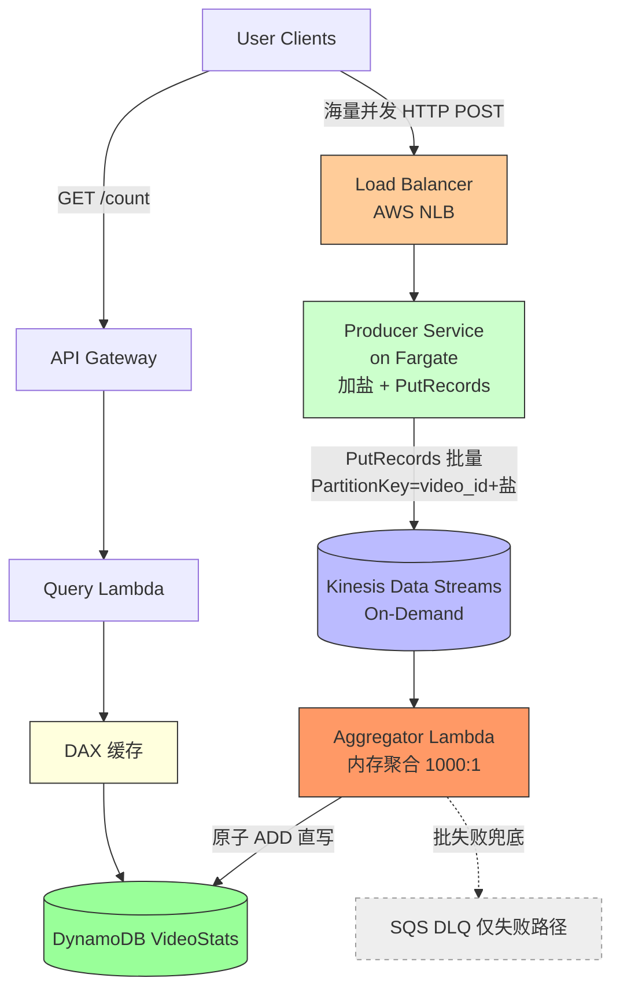

# RFC-002: 分布式高并发实时计数系统(**Kinesis 版,推荐**)

> 与 `rfc-001`(Kafka 版)并列的第二套方案,**本题首选**。
> 适用前提:**技术栈可自由选型(无 Kafka 历史包袱)**,流量是 **YouTube/TikTok 式偶发爆款**(平时低、偶尔冲到 1M QPS)。
> 目标:**托管省运维 + 偶发流量下成本最优**。
> 两版的横向对比、成本对照、选型决策树见 `rfc-003-kafka-vs-kinesis-comparison.md`。

---

## 1. 业务背景与需求定义

同 `rfc-001`:**峰值** 写吞吐 $\ge 1{,}000{,}000$ QPS、SLA 99.99%+、写入 $P99 \le 10\text{ms}$、最终一致、读路径低延迟查询。

**流量形态假设(贯穿成本分析)**:1M QPS 是**偶发峰值**(~3 次/周,每次 ~2h),不是 24/7 常态。详见 §7。

---

## 2. ⭐ 技术选型:为什么选 Kinesis 而不是 Kafka?

| 维度 | Kafka / MSK | **Kinesis Data Streams** | 对本题的影响 |
|---|---|---|---|
| 流的运维 | 自己管 broker、VPC、版本、分区再均衡、容量 | **全托管**,On-Demand 自动扩缩 | ✅ Kinesis 几乎零运维 |
| 闲时成本 | **broker 24/7 常驻**,偶发流量利用率极低 | **On-Demand 按用量,闲时趋近 0** | ✅ Kinesis 对偶发流量更省 |
| 接入方式 | **必须**自建生产者(API GW 跑不了 Kafka Producer) | **可选**:低流量直接 API GW 原生写;高流量用 NLB+Fargate | ✅ Kinesis 更灵活 |
| 弹性 | 改分区数 = 运维动作,只增难减 | On-Demand 自动按吞吐扩缩 | ✅ Kinesis 省心 |
| 与 Lambda 集成 | MSK ESM | 原生 ESM(+ `ReportBatchItemFailures`) | 打平 |
| 生态/能力 | 极强:Connect、Streams/Flink、可移植、跨云 | 够用偏薄,AWS 强绑定 | Kafka 占优 |

### 2.1 结论:本题(偶发爆款 + 无 Kafka 包袱)选 **Kinesis**
1. **流全托管 + On-Demand 自动扩缩**:不用养 broker,**闲时成本趋近 0**——这对「偶发 1M QPS」是决定性优势(Kafka 的 broker 即使没流量也 24/7 烧钱)。
2. **接入方式灵活**:Kinesis 可以「低流量用 API GW 原生写、零计算」,也可以「高流量用 NLB+Fargate 压成本」;Kafka 则**永远**绕不开自建生产者。
3. **运维心智轻**:整条链路(NLB/API GW + Kinesis + Lambda + DynamoDB + DAX)几乎全托管。

### 2.2 什么时候仍应选 Kafka
- 已有 Kafka 生态/技能/Connect 管道;需要复杂流处理(Kafka Streams/Flink)、跨云可移植、超长回放;或**流量长期拉满**(此时 Kafka 预置单位成本更低)。

---

## 3. 概要架构设计 (High-Level Architecture)

> 为了把成本压到与 Kafka 版同量级,**写热路径用 `NLB → Fargate 生产者 → Kinesis`,而不是 API Gateway**(原因见 §7:API Gateway 按请求计费在 1M QPS 下是成本黑洞)。
> API Gateway 原生写 Kinesis 仍是**低流量场景的可选项**(见 §4.2)。



**与 Kafka 版的唯一本质差别**:流从 `MSK(自管 broker)` 换成 `Kinesis(全托管 + On-Demand)`。接入(NLB+Fargate)、聚合(Lambda)、存储(DynamoDB)、读路径(DAX)都一样。

---

## 4. 详细设计

### 4.1 ⭐ PutRecords 是什么?加盐在哪做?

**先讲 `PutRecords`(很多人分不清它和 `PutRecord`):**
- **`PutRecord`(单数)**:一次 API 调用只写 **1 条** record。1M QPS 就要 1M 次/秒 API 调用 → 开销大、成本高。
- **`PutRecords`(复数)**:一次 API 调用**批量写最多 500 条** record(单次 ≤ 5 MB)。
- **为什么用 PutRecords**:把多条事件**合并成一次调用** → API 调用次数降几百倍 → **吞吐更高、成本更低、对 Kinesis 压力更小**。
- **怎么用**:Fargate 生产者收到 HTTP 请求后,在内存里缓冲几毫秒,凑够一批(或到时间窗)就用 `PutRecords` 一次性写入。每条 record 形如:

```json
{ "Data": "<事件内容>", "PartitionKey": "video_123_7" }
```

- **注意部分失败**:`PutRecords` 可能**部分成功**(响应里 `FailedRecordCount > 0`),生产者要检查响应、只对失败的那几条重试(否则会丢数据)。

**加盐在哪做**:Kinesis 用 `PartitionKey` 决定 record 落到哪个 shard(`shard = hash(PartitionKey)`)。**加盐 = 在 Fargate 生产者里给每条 record 的 `PartitionKey` 拼上随机后缀**(`video_id + "_" + Random(1,M)`),把热点 video 打散到多个 shard,从而多个消费者并行。

> **加盐 ⇄ 聚合 是一对**:盐把 video 打散到多 shard,Aggregator Lambda 按 `video_id` 去盐聚合、DynamoDB `ADD` 合并,缺一不可。

### 4.2 (可选)低流量场景:API Gateway 原生写 Kinesis,零计算

如果某个环境流量不高(没到让 API Gateway 成本爆炸的量级),可以**不要 Fargate**,直接用 **API Gateway 原生集成 Kinesis `PutRecord`**,在 mapping template 里加盐:

```velocity
#set($videoId = $input.path('$.video_id'))
#set($salt = $context.requestTimeEpoch % 16)
{ "StreamName": "video-clicks", "PartitionKey": "${videoId}_${salt}",
  "Data": "$util.base64Encode($input.json('$'))" }
```

> 这是 Kinesis 相对 Kafka 的灵活性:**低流量可以零计算接入,高流量再切到 NLB+Fargate 压成本。** Kafka 没有「零计算接入」这个选项。

### 4.3 ELB / NLB 是什么?它和 Fargate 怎么交互?

- **ELB = Elastic Load Balancing**(AWS 负载均衡器家族),把海量客户端连接分摊到后端多个实例。**NLB**(Network LB,四层/TCP)**吞吐极高、延迟极低、扛千万级连接**,适合本场景的超高 QPS 纯转发(ALB 是七层/HTTP,功能多但本场景用不上)。
- **Fargate** = 无需管服务器的容器运行环境;生产者以**容器任务(Task)**形式运行,多个 Task 组成 ECS Service。
- **交互**:Task 注册进 NLB 的 **Target Group**,NLB 做**健康检查**并把连接分摊给健康的 Task;流量上涨时 **ECS Auto Scaling** 自动加 Task 并注册进 Target Group,回落自动缩容。即 `Client → NLB(分发+健康检查)→ [Fargate Task 1..N](加盐+PutRecords)→ Kinesis`。(更详细见 `rfc-001` §4.1。)

### 4.4 攒批 + 内存聚合
* ESM(Event Source Mapping,AWS 托管的轮询器,不是要部署的服务):`BatchSize = 1000`、`MaximumBatchingWindowInSeconds = 1`。
* Lambda 内存 `HashMap` 按 `video_id` 去盐累加,1000:1 压缩,再对每个 video 执行 DynamoDB `ADD`。
* `ParallelizationFactor`(每 shard 1~10 并发消费者)可进一步提升单 shard 并行度。

### 4.5 分片(shard)估算
- 单 shard 写入上限:**1 MB/s 或 1000 records/s**(取先到者)。
- 峰值 1M records/s ⇒ 理论上 ~**1000 shards**(On-Demand 自动按吞吐扩,无需手动规划);盐的 M 应保证单热点 key 铺满足够多 shard。

### 4.6 读路径:为什么 GET 要走 DAX,而不是直读 DynamoDB?

**DAX = DynamoDB Accelerator**,AWS 专为 DynamoDB 打造的**全托管内存缓存**,API 与 DynamoDB 完全兼容(SDK 几乎零改造,未命中自动回源),延迟从个位数毫秒降到微秒级。
为什么必须经 DAX:① **读也是热点**(写靠加盐打散,但读全网都查同一个 `video_123` → 命中同一 item,单 partition 读上限约 3000 RCU/s 会 throttling);② **延迟**微秒级满足 P99;③ **成本**:命中即省一次 RCU 计费,读 QPS 远高于写时省一个数量级;④ 计数最终一致,几秒 TTL 可接受。读不热时可不用 DAX。

### 4.7 ⭐ 消费失败时 Kinesis 会怎样?和 Kafka 有什么区别?

**Kinesis 消费失败有兜底吗?——有,机制和 Kafka 几乎一样:Kinesis 是「持久化日志」,不是队列。**
- **数据按 retention 保留,与是否被消费无关**:默认 24h(最长 365 天)。消费失败 ≠ 丢数据,记录还在流里可重读。
- **ESM 维护 shard 级 checkpoint(类似 Kafka 的 offset)**:处理成功才推进;失败默认对该批反复重试直到成功或过期。
- **精细化失败控制**:`MaximumRetryAttempts`、`MaximumRecordAgeInSeconds`、`BisectBatchOnFunctionError`(批内二分),以及 **`ReportBatchItemFailures`——只重试批里真正失败的那几条**,减少整批重放造成的重复累加。
- **On-failure destination → DLQ 只存指针**:投到 SQS DLQ 的是失败批的 `shardId + sequenceNumber 区间`,**不是消息体**(消息体还在 Kinesis 里)。
- **Head-of-Line 阻塞**:同 shard 严格有序,坏批不丢会阻塞后续;用放弃阈值甩进 DLQ 后继续推进。

| 维度 | Kafka / MSK | Kinesis Data Streams |
|---|---|---|
| 本质 | 持久化日志 | 持久化日志(同类) |
| 失败后数据 | 留在分区,按 retention(可很长) | 留在 shard,默认 24h(最长 365 天) |
| 消费位点 | Offset(broker 管理) | Shard checkpoint(ESM 托管) |
| 部分批精确重试 | 较弱 | ✅ `ReportBatchItemFailures` |
| DLQ 内容 | 指针(partition+offset) | 指针(shardId+sequenceNumber) |

> 两者失败语义高度一致:**日志 + 位点 + 失败留存原始数据 + DLQ 存指针**。差别主要在 Kafka 保留更随心(自管)、Kinesis 默认保留短但托管;Kinesis 的 `ReportBatchItemFailures` 让部分批精确重试更顺手。
> 对照 SQS:**SQS 消费成功即删除**,所以 SQS 作源时 DLQ 必须存**消息体**;流式源失败后原始数据仍在流里,DLQ 只需存指针。

---

## 5. ⭐ 为什么去掉 SQS 缓冲?为什么 DLQ 又用 SQS?

**主链路去掉 SQS**(原初版 `Aggregator → SQS → Writer → DynamoDB`):
1. **削峰已由聚合完成**:压缩后单 `video_id` 写速率 ≈ `M × (1/window)` ≈ 每秒几十条,全表几百~几千 WCU,DynamoDB + `ADD` 直接吃下。**真正削峰的是聚合,不是 SQS。**
2. **再塞 SQS 只增坏处**:多一跳延迟/成本/故障面;SQS 无序 + at-least-once 让幂等更复杂;且它不会再聚合,纯属多余一跳。
3. **DB 故障兜底用 ESM 原生能力**:重试 + 二分 + on-failure destination,不污染 happy path。

**但 DLQ 用 SQS(不矛盾)**:我们砍的是「主链路里每条都过的 SQS」,留的是「只有失败批才进的 DLQ」。DLQ 要的是 **pull + 持久保留(14 天)+ redrive**,正是 SQS 的强项;它也是 Lambda on-failure destination 的官方目标(**选 SQS 不选 SNS**:SNS 是推送告警、不持久;DLQ 要攒住可回查可重处理)。DLQ 流量极小(只有重试到顶仍失败的批),成本可忽略,且存的是指针不是数据。

> 一句话:**主链路砍掉 SQS(聚合已削峰);DLQ 用 SQS(它是天然的失败件暂存 + 重投装置)。**

---

## 6. 基础设施即代码 (Terraform,节选)

```hcl
# 1. Kinesis(On-Demand,闲时趋零、零运维)
resource "aws_kinesis_stream" "video_clicks" {
  name             = "video-clicks"
  stream_mode_details { stream_mode = "ON_DEMAND" }
  retention_period = 24 # 小时,可调到最长 8760(365 天)
}

# 2. 失败兜底 DLQ
resource "aws_sqs_queue" "counter_dlq" {
  name                      = "video-counter-dead-letter-queue"
  message_retention_seconds = 1209600
}

# 3. Aggregator Lambda + ESM(攒批聚合 + 失败兜底)
resource "aws_lambda_function" "aggregator" {
  function_name = "video-click-aggregator"
  role          = aws_iam_role.lambda_exec_role.arn
  handler       = "index.handler"
  runtime       = "nodejs20.x"
  memory_size   = 512
  timeout       = 30
}

resource "aws_lambda_event_source_mapping" "kinesis_esm" {
  event_source_arn  = aws_kinesis_stream.video_clicks.arn
  function_name     = aws_lambda_function.aggregator.arn
  starting_position = "LATEST"

  batch_size                         = 1000
  maximum_batching_window_in_seconds = 1
  parallelization_factor             = 10

  function_response_types = ["ReportBatchItemFailures"] # 部分批精确重试
  destination_config { on_failure { destination_arn = aws_sqs_queue.counter_dlq.arn } }
}

# 4. DynamoDB(原子 ADD;偶发流量用 On-Demand)
resource "aws_dynamodb_table" "video_stats_table" {
  name         = "VideoStats"
  billing_mode = "PAY_PER_REQUEST"
  hash_key     = "video_id"
  attribute { name = "video_id"  type = "S" }
  point_in_time_recovery { enabled = true }
}

# 5. 接入层:NLB + ECS Fargate 生产者(加盐 + PutRecords)
#    结构同 rfc-001 §5.2(aws_lb network / aws_ecs_service FARGATE / app autoscaling),
#    区别仅在容器内调用的是 Kinesis PutRecords(而非 Kafka Producer)。
```

---

## 7. ⭐ 计费成本分析 (Cost Analysis)

> 单价按 us-east-1 近似,仅作**量级**参考,以 AWS 官方为准。

### (a) 流量模型(YouTube/TikTok 式偶发爆款)
| 参数 | 取值 |
|---|---|
| 平峰基线写入 | ~20,000 QPS |
| 爆款峰值写入 | 1,000,000 QPS |
| 爆款频率 | ~3 次/周 × ~2h ≈ **26 小时/月** |
| 平峰时长 | ≈ **704 小时/月** |

**月写请求量** = `20,000×3600×704`(平峰 ≈ 507 亿)+ `1,000,000×3600×26`(峰值 ≈ 936 亿)≈ **1,440 亿/月**。

### (b) 为什么写入口不用 API Gateway?(算给你看)
- HTTP API ~$1.0/百万(>3 亿后 ~$0.9/百万)。
- `1,440 亿 = 144,000(百万)× ~$0.9 ≈` **约 $13 万/月**(仅网关一项)。
- 若**持续** 1M QPS:`2.6 万亿 × $0.9/百万 ≈` **约 $234 万/月**。
- 结论:**API Gateway 按请求计费在此量级是黑洞 → 写热路径改用 NLB+Fargate。**(低流量环境仍可用 API GW,见 §4.2。)

### (c) 写入口改用 NLB + Fargate(算给你看)
- **NLB**:~$16/月基础 + LCU ≈ 几百美元 → **~$0.05 万/月**。
- **Fargate(autoscaling)**:设单 vCPU ~5,000 req/s。峰值 `200 vCPU × 26h` + 平峰 `4 vCPU × 704h` ≈ `8,016 vCPU·h × ~$0.04` + 内存 ≈ **~$0.05~0.1 万/月**(闲时随 autoscaling 趋近 0)。
- **接入层合计 ≈ ~$0.1 万/月**。
- **对比:API Gateway ~$13 万 vs NLB+Fargate ~$0.1 万 ≈ 差 ~100 倍**,这 100 倍**全来自网关选型**。

### (d) 其余各层
- **Kinesis(On-Demand)**:数据量 ≈ `1,440 亿 × ~500B ≈ 72 TB/月`;摄入 ~$0.08/GB + 读出 ~$0.04/GB ≈ **~$0.6~0.9 万/月**,**闲时随用量下降**(无 broker 常驻)。
- **Aggregator Lambda**:聚合后调用 ≈ `1.44 亿/月` × $0.2/百万 + GB·秒 → **~$0.1 万/月**。
- **DynamoDB**:偶发流量用 On-Demand → **~$0.1~0.3 万/月**。
- **DAX**:节点常驻 → ~$0.05 万/月。
- **本方案总计 ≈ $0.9~1.5 万/月量级**,且**闲时自动往下走**。

### (e) 与 Kafka 版对比的本质
- **改用 NLB+Fargate 后,两版接入成本拉平(~$0.1 万)**;剩下的差别只在「流」:
  - Kinesis On-Demand:**用多少付多少,闲时趋零** → 偶发流量更省、零运维。
  - MSK:**broker 24/7 常驻** → 偶发流量利用率低、还要运维。
- **所以偶发流量场景:Kinesis 总成本更友好(且更省心),与 Kafka 版同量级而非差 100 倍。** 详见 `rfc-003`。

### (f) 聚合是最大省钱杠杆
聚合 1000:1 把 Lambda 调用与 DynamoDB 写都砍约 1000 倍(不聚合光 DynamoDB 写就是百万美元/月级)。**面试金句:聚合不只为吞吐,更为成本。**

---

## 8. 系统局限性与权衡

* **最终一致**:聚合窗口(≤1s)+ 回写延迟,刚写后立刻读可能短暂读旧值;读路径用 DAX。CAP 下用一致性换可用性,计数业务可接受。
* **At-Least-Once / 重复计数**:默认非幂等换吞吐;要精确用幂等键(`shardId+sequenceNumber` 区间或 UUID)+ DynamoDB 条件写。`ReportBatchItemFailures` 可减少整批重放的重复。
* **PutRecords 部分失败**:生产者必须检查响应、对失败 record 重试,否则丢数据。
* **偶发峰值的冷启动/扩容**:Fargate autoscaling 与 Kinesis On-Demand 扩容都有秒~分钟级滞后;爆款来临瞬间可设最小常驻容量 + 预热缓冲应对。

---

## 9. 两套方案对比

完整对比、成本对照、消费失败差异、选型决策树见 **`rfc-003-kafka-vs-kinesis-comparison.md`**。
