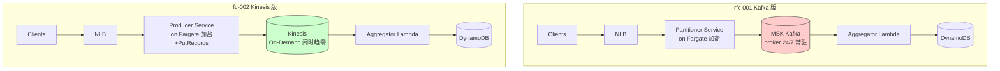
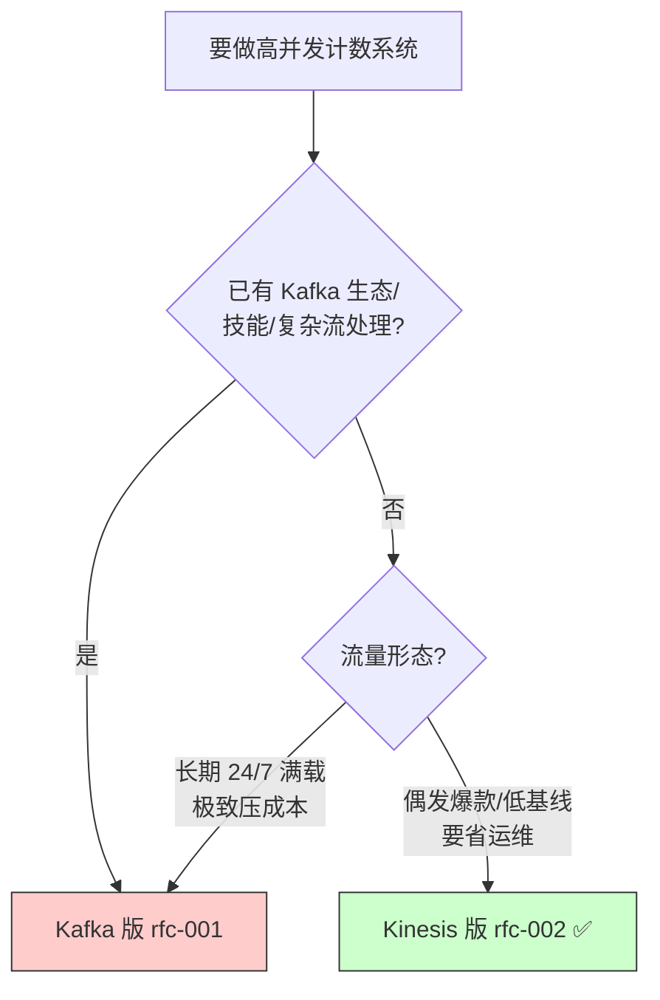

# RFC-003: Kafka 版 vs Kinesis 版 —— 分布式计数系统方案对比

> 本文是对两套方案的横向对比与选型决策文档:
> - **`rfc-001`**:Kafka 版(已有 Kafka、无法切换时用)
> - **`rfc-002`**:Kinesis 版(自由选型 + 偶发爆款流量时用)← **本题推荐**
>
> 两套方案**接入层与下游已经统一**:接入都用 `NLB → Fargate 生产者(加盐)`,下游都是 `Lambda 攒批聚合(1000:1) → DynamoDB 原子 ADD`,读路径都是 `API Gateway → Lambda → DAX → DynamoDB`。
> **唯一的本质差异在「流」这一段:MSK(自管 broker)vs Kinesis(全托管 + On-Demand)。**

---

## 0. 重要前提:流量是「偶发爆款」,不是 24/7 满载

| 参数 | 取值(假设) |
|---|---|
| 平峰基线写入 | ~20,000 QPS |
| 爆款峰值写入 | 1,000,000 QPS |
| 爆款频率 | ~3 次/周 × ~2h ≈ **26 小时/月** |
| 平峰时长 | ≈ **704 小时/月** |
| 月写请求量 | ≈ **1,440 亿/月** |

这个前提直接决定了成本结论:**偶发流量下,「按量付费 + 闲时趋零」比「24/7 预置常驻」更省**——这对 Kinesis 有利。

---

## 1. 一句话结论

| 你的处境 | 选 |
|---|---|
| 没有 Kafka 包袱 / 偶发爆款流量 / 要省运维 | **Kinesis 版(rfc-002)** ← 本题 & 面试默认推荐 |
| 已有 Kafka 生态 / 团队技能 / 复杂流处理 / 流量长期拉满 | **Kafka 版(rfc-001)** |

核心矛盾:**Kinesis 流全托管 + On-Demand 闲时趋零(偶发流量更省、更省心);Kafka 流要自管 broker 且 24/7 常驻(有生态优势,但偶发流量利用率低)。**

---

## 2. 架构并排对比(接入层已统一)

**关键变化**:之前 Kinesis 版用 API Gateway 原生写入(0 计算但 ~$13 万/月),现已改成和 Kafka 版一样的 `NLB + Fargate` 接入,**把那 ~100 倍的网关成本砍掉**。于是两版只剩「流」不同。

---

## 3. 逐维度对比

| 维度 | **Kafka 版(rfc-001)** | **Kinesis 版(rfc-002)** |
|---|---|---|
| 接入 | NLB + Fargate 生产者(加盐) | NLB + Fargate 生产者(加盐 + PutRecords) |
| 写流的方式 | Kafka Producer | `PutRecords` 批量(≤500 条/次) |
| 流 | MSK / Kafka | Kinesis Data Streams |
| 流的运维 | 管 broker、VPC、版本、再均衡、容量 | **全托管**,On-Demand 自动扩缩 |
| 流的计费 | **broker 24/7 常驻**(预置) | **按用量,闲时趋零** |
| 低流量可零计算接入? | ❌ 永远要生产者 | ✅ 可退化为 API GW 原生写(见 rfc-002 §4.2) |
| 默认保留 | 配置驱动(常见 7 天,可很长) | 默认 24h(最长 365 天) |
| 与 Lambda 集成 | MSK ESM | 原生 ESM(+ `ReportBatchItemFailures`) |
| 生态/能力 | 极强:Connect、Streams/Flink、可移植、跨云 | 够用偏薄,AWS 强绑定 |
| 偶发流量总成本 | 略高(MSK 常驻) | **略低 + 更省心** |
| 何时选 | 有 Kafka/复杂流/长期满载 | 无包袱/偶发流量/省运维 |

---

## 4. ⭐ 成本深度对比

> 单价按 us-east-1 近似,仅作量级参考。流量用 §0 模型(≈ 1,440 亿请求/月)。

### 4.1 共同省钱杠杆:聚合(1000:1)
两版都靠 Lambda 攒批聚合,把下游按量项砍约 1000 倍:

| | 不聚合(直写) | 聚合后 |
|---|---|---|
| Aggregator Lambda 调用 | ~1,440 亿/月 | ~1.44 亿/月 |
| DynamoDB 写 | 百万美元/月级 | 下降约 3 个数量级 |

**面试金句:聚合不只为吞吐,更为成本——砍掉 Lambda 调用和 DynamoDB WCU 约 3 个数量级。**

### 4.2 ⭐ 接入层:为什么不用 API Gateway(这才是原来差 100 倍的根源)

| 接入方案 | 月成本量级 | 计算 |
|---|---|---|
| **API Gateway**(原 Kinesis 版) | **~$13 万** | `1,440 亿 ÷ 百万 × ~$0.9` |
| **NLB + Fargate**(现两版统一) | **~$0.1 万** | NLB ~$0.05 万 + Fargate autoscale ~$0.05~0.1 万 |

> **那 ~100 倍差距全部来自「网关选型」,跟 Kafka/Kinesis 无关。** 把 API Gateway 从写热路径换成 NLB+Fargate 后,两版接入成本拉平到 ~$0.1 万/月。

**Fargate 成本怎么算的**:设单 vCPU ~5,000 req/s。峰值 `1,000,000/5,000 = 200 vCPU × 26h` + 平峰 `20,000/5,000 = 4 vCPU × 704h` ≈ `8,016 vCPU·h × ~$0.04` + 内存 ≈ ~$0.05~0.1 万/月,**闲时随 autoscaling 趋近 0**。

### 4.3 ⭐ 流层:两版唯一真正的成本差异

| 流 | 月成本量级 | 性质 |
|---|---|---|
| **MSK(Kafka)** | ~$0.3~0.8 万 | **broker 24/7 常驻**;峰值仅占 26h/月,利用率低 → 偶发流量"不够省" |
| **Kinesis(On-Demand)** | ~$0.6~0.9 万 | 按数据量(~72 TB/月 × ~$0.08/GB 摄入 + 读出)→ **闲时随用量下降**,且零运维 |

> 两者量级相近;但 **Kinesis 闲时会往下走、且不用运维 broker**,在偶发流量下综合更优。MSK 的钱大部分花在「没流量时也开着的 broker」上。

### 4.4 下游成本(两版相同)
- **DynamoDB**:偶发流量用 **On-Demand**(闲时不花钱)~$0.1~0.3 万/月。
- **DAX**:节点常驻 ~$0.05 万/月,换读 RCU 成本下降一个数量级。
- **Lambda / DLQ(SQS)**:聚合后量极小,可忽略。

### 4.5 总账(偶发流量模型)

| | Kafka 版 | Kinesis 版 |
|---|---|---|
| 接入(NLB+Fargate) | ~$0.1 万 | ~$0.1 万 |
| 流 | ~$0.3~0.8 万(常驻) | ~$0.6~0.9 万(按量,闲时降) |
| Lambda + DynamoDB + DAX | ~$0.3~0.5 万 | ~$0.3~0.5 万 |
| **合计** | **~$0.7~1.4 万/月** | **~$1.0~1.5 万/月** |

> **结论:两版同量级(~1.5x 以内),不再是 100 倍。** 偶发流量下 Kinesis 更省心(零 broker 运维 + 闲时降本);Kafka 在「长期满载」时因 broker 摊薄会反超变更便宜。

---

## 5. ⭐ 消费失败处理对比(Kinesis 失败了有兜底吗?)

**有,而且和 Kafka 几乎一样——两者都是「持久化日志」,不是「队列」。**

| 维度 | Kafka / MSK | Kinesis Data Streams |
|---|---|---|
| 本质 | 持久化日志 | 持久化日志(同类) |
| 失败后原始数据 | **留在分区**(按 retention) | **留在 shard**(按 retention) |
| 消费位点 | Offset(broker 管理) | Shard checkpoint(Lambda ESM 托管) |
| 失败重试(ESM) | 自动重试 + `BisectBatchOnFunctionError` 二分 | 同左 |
| 放弃阈值 | `MaximumRetryAttempts` / `MaximumRecordAgeInSeconds` | 同左 |
| 部分批精确重试 | 较弱 | ✅ `ReportBatchItemFailures`(只重试坏的那几条) |
| On-failure → DLQ 内容 | **指针**(partition+offset 区间) | **指针**(shardId+sequenceNumber 区间) |
| 默认保留 | 常见 7 天(自管,可更长) | 默认 24h(最长 365 天) |

**要点:**
1. **Kinesis 消费失败不丢数据**——记录按 retention 留在流里,checkpoint 不前进,可重读(同 Kafka)。
2. 两者 DLQ 都只存**指针**,因为原始数据还在流里。**对照 SQS:消费成功即删除,所以 SQS 作源时 DLQ 必须存消息体本身。**
3. 差异:Kafka 保留更随心(自管),Kinesis 默认保留短但托管;Kinesis 的 `ReportBatchItemFailures` 让「部分批精确重试」更顺手,减少整批重放的重复计数。

---

## 6. 两个共性设计点

### 6.1 为什么 GET 走 DAX,不直连 DynamoDB?
- **DAX = DynamoDB 专用全托管内存缓存**,API 兼容、drop-in,延迟从毫秒降到微秒。
- **读也是热点**:写靠加盐打散,但读全网都查同一个 `video_123` → 命中同一 item,单 partition 读上限约 3000 RCU/s 会 throttling;DAX 在内存挡掉重复读。
- 顺带:降读延迟(满足 P99)+ 省 RCU 成本(命中即省一次计费),计数最终一致、容忍几秒 TTL。读不热时可不用。

### 6.2 为什么主链路去掉 SQS,但 DLQ 又用 SQS?
- **主链路去掉**:削峰已由聚合完成,聚合后写量每秒几十~几百条,DynamoDB + ADD 直接吃下;再塞 SQS 只增延迟/成本/故障面,且它不会再聚合,纯属多余一跳。
- **DLQ 用 SQS**:DLQ 要 pull + 持久保留(14 天)+ redrive,正是 SQS 强项;也是 Lambda on-failure 官方目标(选 SQS 不选 SNS,因为要攒住可回查)。DLQ 流量极小,成本可忽略。
- **不矛盾**:砍的是「每条都过的主链路 SQS」,留的是「只有失败才进的 DLQ」。

---

## 7. 选型决策树

**面试推荐表述**:
> 「接入我两版都用 **NLB + Fargate 生产者**(加盐),**不用 API Gateway**——因为 1M QPS 按请求计费会到 ~$13 万/月,而 NLB+Fargate 只要 ~$0.1 万/月,差 100 倍。流我**默认选 Kinesis**:全托管、On-Demand 闲时趋零,贴合 YouTube/TikTok 那种**偶发爆款**流量;如果团队已有 Kafka 生态或流量长期满载,我会换成 MSK。两版下游完全一样:Lambda 攒批 1000:1 聚合 + DynamoDB 原子 ADD,读路径用 DAX 抗读热点。」
